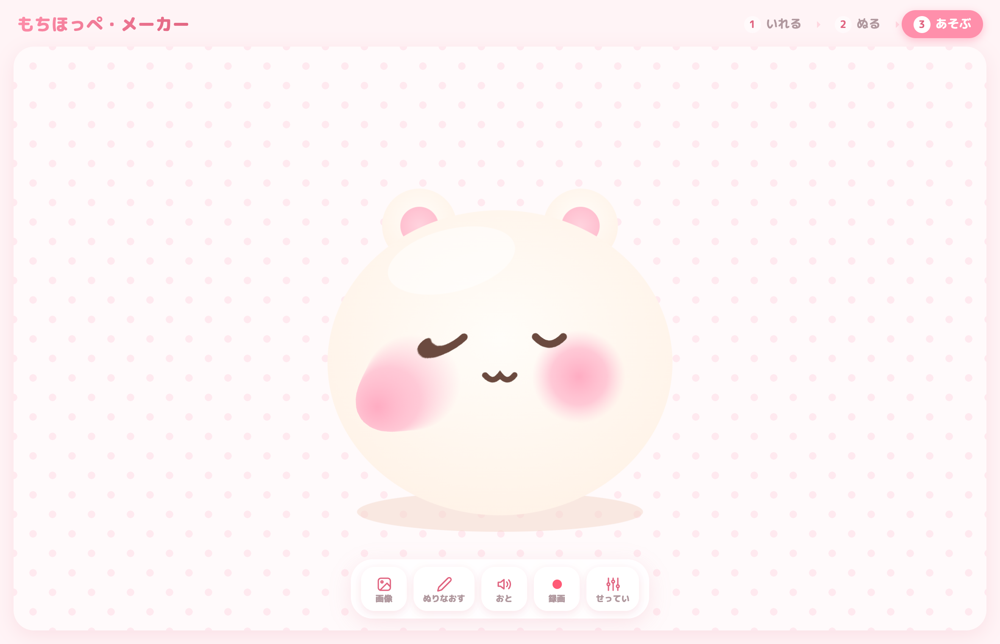
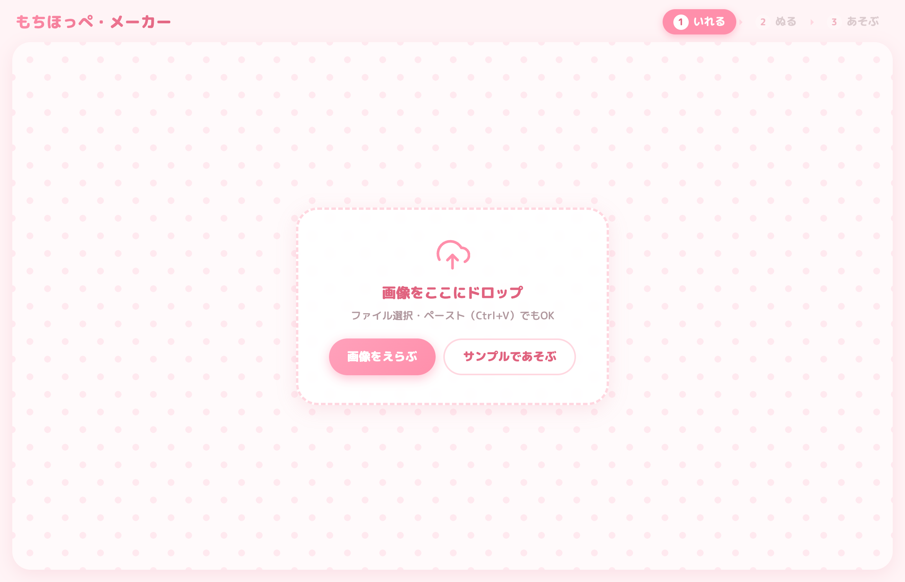
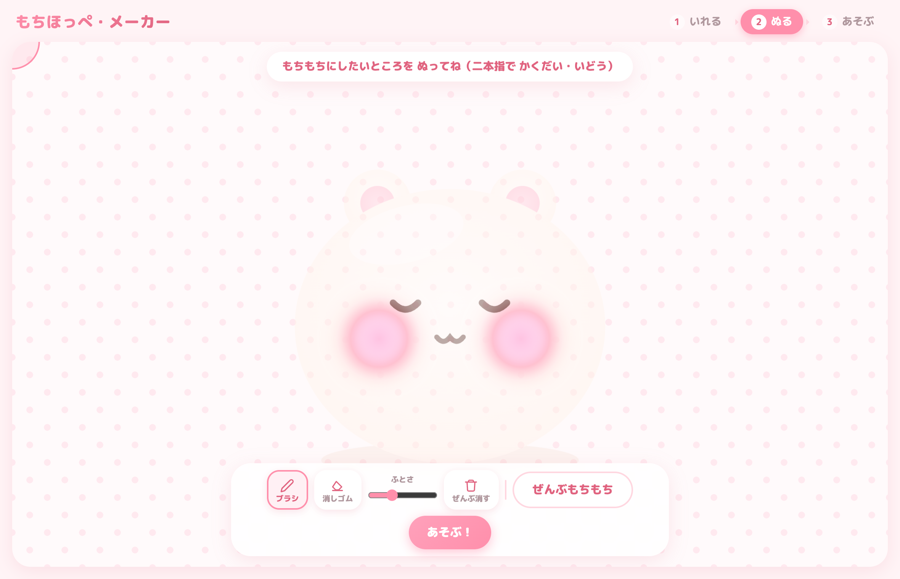

# もちほっぺ・メーカー

すきな画像のほっぺを、もちもち引っぱって遊べるWebおもちゃです。

**▶ あそぶ → https://saba383810.github.io/moti_hoppe_maker/**

## あそびかた

### ① いれる

すきな画像を **ドロップ / ファイル選択 / ペースト** で入れます。
「サンプルであそぶ」を押すと、すぐに試せます。

### ② ぬる

もちもちにしたいところ（ほっぺ）をブラシで塗ります。

- スマホは **二本指で拡大・回転・移動** しながら細かく塗れます（PCはホイールでズーム）
- 「ぜんぶもちもち」を押すと、塗らずに画像全体をもちもちにできます

### ③ あそぶ

つまんで引っぱって、ぱっと離すと **ぷるんっ** と揺れて戻ります。

- 引っぱるほど「もちっ」と抵抗が強くなります
- フリックしながら離すと、勢いよく揺れます
- スマホなら **両ほっぺ同時づかみ** もできます

## そのほかの機能

- **せってい** — やわらかさ・のびる量・ゆれ具合をお好みに調整
- **おと** — むにゅっとした効果音つき（オフにもできます）
- **録画** — 遊んでいる様子を動画（WebM）や GIF で保存してシェア
